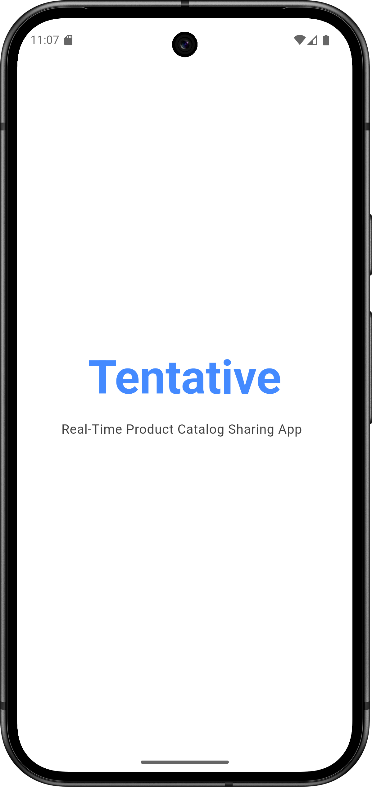
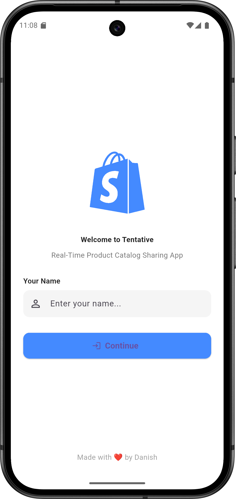
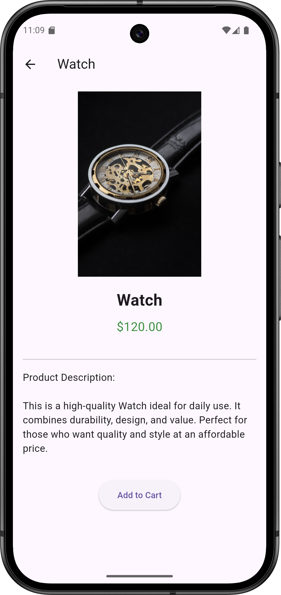
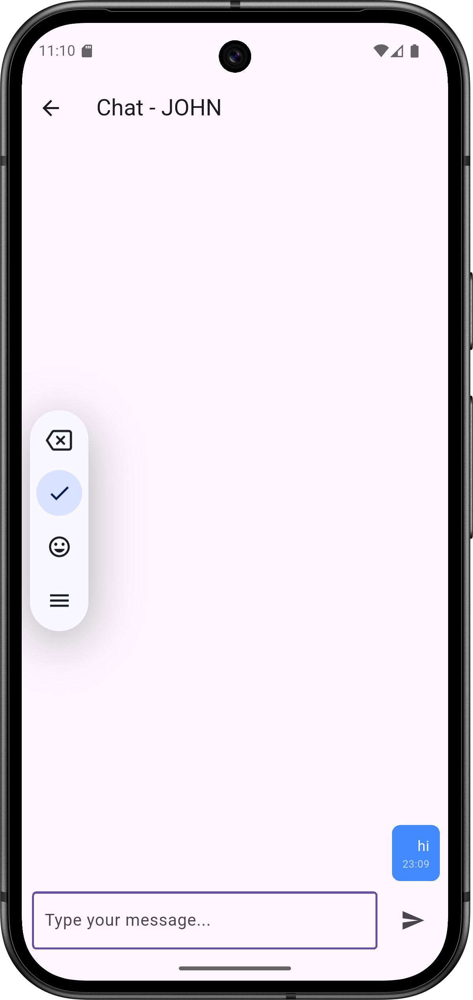

# 🛍️ Tentative : Real-Time Product Catalog Sharing App

A Flutter mobile app that allows users to browse a shared product catalog in real time with chat support, synchronized scrolling, and live user interactions. Built using Flutter, GetX, and Socket.IO.

---

## 🚀 Features

### 🎯 Core Features
- 📦 Product catalog grid view
- 🖼️ Product detail view with images, name, price
- 🔁 Real-time scroll sync across users
- 🧑‍🤝‍🧑 Multiplayer presence awareness (join/leave notifications)
- 💬 In-app chat system with typing indicators
- 📢 Admin broadcast message feature
- 👋 Logout and user session handling

---

## 🛠️ Tech Stack

| Layer       | Technology                                       |
|-------------|--------------------------------------------------|
| Frontend    | Flutter (GetX, Dart)                             |
| Backend     | Node.js (Socket.IO)                              |
| Communication | WebSockets (Socket.IO)                           |
| UI State    | GetX (Controllers, Views)                        |
| Image Cache | `cached_network_image` - now using asset images. |

---

## 📸 Screenshots

| Splash Screen                             | Login Page                            | Catalog Grid                              | Product Detail                                   | Chat                                   |
|-------------------------------------------|---------------------------------------|-------------------------------------------|--------------------------------------------------|----------------------------------------|
|  |  |  |  |  | 


---

## 📂 Project Structure

```
lib/
├── main.dart
├── models/
│   └── product_model.dart
├── services/
│   └── socket_service.dart
├── modules/
│   ├── login/
│   │   ├── login_view.dart
│   │   └── user_controller.dart
│   ├── catalog/
│   │   ├── catalog_view.dart
│   │   ├── catalog_controller.dart
│   │   └── product_detail_view.dart
│   └── chat/
│       ├── chat_view.dart
│       └── chat_controller.dart
assets/
├── images/
│   └── [product_images].jpg
└── screenshots/
│     └── [screens].png
backend/
└── server.js   
 
```

---

## ⚙️ Getting Started

### 🔧 Prerequisites
- Flutter 3.x installed
- Node.js v16+ installed
- Android/iOS device or emulator
- Both device and server on same local network (for testing multiplayer)

---

## 📱 Flutter App Setup

1. **Clone the repo**
```bash
git clone https://github.com/DANISH-T-P/Tentative.git
cd product_catalog
```

2. **Install dependencies**
```bash
flutter pub get
```

3. **Run on device/emulator**
```bash
flutter run
```

4. **Build APK (optional)**
```bash
flutter build apk --release
```

---

## 🖥️ Node.js Socket Server Setup

1. **Navigate to `server/` directory**
```bash
cd server
```

2. **Install dependencies**
```bash
npm install
```

3. **Run server**
```bash
node server.js
```

4. **Ensure it runs on your machine's local IP** (e.g. `192.168.1.10:3000`)

---

## 🧪 Testing Multiplayer / Chat

### Setup:
- Install APK on two real devices or use one device + emulator.
- Ensure both are on the **same WiFi** network.
- Start `server.js` on your PC.
- Update `socket_service.dart` with your **local IP** (not `localhost`).

```dart
 // _socket = IO.io('http://10.0.2.2:3000', <String, dynamic>{ // use this line for Web run.
 // _socket = IO.io("http://192.168.1.10:3000", <String, dynamic>{ // use this line for mobile run.
```

---

## 🔐 Environment Notes

- No authentication or database is used. Usernames are passed via navigation arguments.
- Assets are locally loaded; image links use `cached_network_image`.

---

## ✅ Future Improvements

- 🔐 Firebase Auth & Firestore
- 🧾 Product details from database
- 📤 Image upload & chat media
- 🌐 Web support
- 📦 App versioning and updates

---

## 🧑‍💻 Author

**Muhammed Danish**  
Flutter Developer | GitHub: [@DANISH-T-P](https://github.com/DANISH-T-P)  
Email: danishtp11@gmail.com

---

## 📄 License

This project is licensed under the MIT License - see the [LICENSE](LICENSE) file for details.
